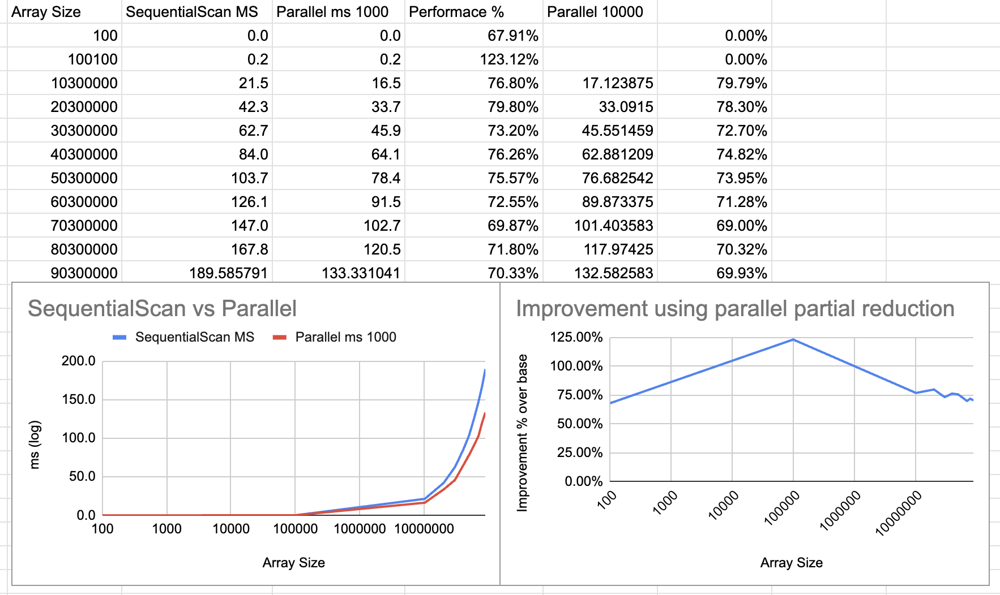

Implementation following [trees](https://www.sciencedirect.com/topics/computer-science/partial-reduction).

The code scan left on a given input array
and output a new array consisting of the maximum values
to the left of a given index in the original array.

Example:
```
In: [0, 0, 1, 5, 2, 3, 6]

Out: [0, 0, 1, 5, 5, 5, 6]
```

### About performance serial vs parallel

For low values of `threshold` the parallel implementation is slower or not much faster than the sequential 
one due to the over head of parallelism. So ideally, the threshold should be set to a value where 
the ForkJoin overhead is compensated by the parallelism. 

On my experiments (on a M2 ARM jvm 17), base on the log scale chart below, the threshold value of ~100000 seems to be a good pick,




On the other hand, there is a trade-off between the complexity of the implementation and the performance gain.

In our case, parallel implementation is faster than the sequential one for large arrays (+60000000),
actually about ~80% faster, but it may still not justify by itself the complexity overhead in most use cases. 


An extra consideration is the memory limitation of a single node system. The sequential implementation is
limited by the memory of the system. whereas the parallel reduction could be easily scaled horizontally by replacing the
local parallel Fork-Join with a distributed like Spark or Akka and minor modifications to the algorithm.

My recommendation is to use the parallel implementation only when the business will benefice from the % performance win,
and to use a distributed implementation when the array size is too large for a single node system.
